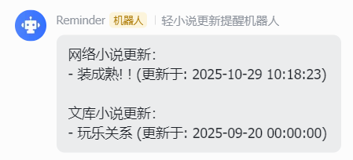

## 轻小说机翻网更新提醒工具

在使用[轻小说机翻机器人](https://n.novelia.cc/)时，我通常习惯于下载到本地进行离线阅读，但也因此很容易错过更新。为了及时了解到关注内容的更新情况，我开发了一款工具帮助我进行监控

NoveliaReminder 是一个用于提醒用户轻小说机翻更新的工具。它可以监控网站中的更新情况，并在有新章节发布时通过多种渠道（如邮件、飞书机器人等）发送通知，以确保用户不会错过任何更新

**只需在网站中收藏对应的的小说，运行该工具即可自动监控更新并发送提醒**

---

**飞书推送示例**



### 快速开始

本项目基于 `Python 3.9` 构建，请在使用前自行配置环境

1. 将项目拉取到本地
   ```bash
   git clone https://github.com/mj3622/NoveliaReminder.git
   cd NoveliaReminder
   ```

2. 安装依赖
   ```bash
   pip install -r requirements.txt
   ```

3. 配置 `config.yaml` 文件，配置项说明参考下文

4. 运行主程序
   ```bash
   python main.py
   ```

> **注意：**
>
> 第一次运行时会创建 `favorie_books.json` 文件用于存储已提醒的章节信息，之后每次运行通过对比该文件来判断是否有新章节发布

### 配置说明

1.账号相关

- `username`: 轻小说机翻网的登录用户名
- `password`: 轻小说机翻网的登录密码

2.推送相关:

- `enabled`: 是否启用该推送方式
- `email`: 邮件通知配置，包括 SMTP 服务器、端口、发件人邮箱、收件人邮箱等
- `feishu`: [飞书机器人通知配置](https://open.feishu.cn/document/client-docs/bot-v3/add-custom-bot)，包括机器人 Webhook
  URL。若开启签名校验，还需填写 `signing_secret`

### 定时监控

建议使用系统的定时任务工具（如 Linux 的 [cron](https://www.runoob.com/w3cnote/linux-crontab-tasks.html)
）来定期运行该脚本，以实现自动化监控和提醒

示例 `cron` 任务（每12小时运行一次）：

```bash
0 */12 * * * /usr/bin/python3 /path/to/NoveliaReminder/main.py
```

### 常见问题

1. **状态码 401/404 错误**

   请检查账号信息是否正确，确保能够正常登录轻小说机翻网

2. **状态码 104 错误**

   该错误通常是由于国内网络环境无法访问轻小说机翻网导致的，请尝试使用代理进行访问

3. **邮件发送失败**

   请检查邮件配置是否正确，确保 **SMTP** 服务器地址、端口、发件人和收件人邮箱均填写无误

4. **如何自定义推送方式**

   可参考 `utils/MsgNotifier` 的实现

    1. 在配置文件中添加新的推送方式配置(enabled 为必填项)
    2. 在 `utils/MsgNotifier.py` 中添加对应的推送类，并实现 `send` 方法
    3. 在 `MsgNotifier` 类的 `initialize_services` 方法中添加新的推送方式初始化逻辑

5. **如何添加新的小说监控**

   只需在轻小说机翻网中收藏对应的小说，程序会自动获取已收藏的小说列表进行监控
6. **控制台运行正常，但是cron任务失败**

   因为cron任务的环境变量可能与控制台不同，建议在cron任务中手动配置代理

### 免责声明

本工具仅供个人学习和使用，遵守相关法律法规及网站的使用条款。如因使用本工具而引发的任何法律责任，作者概不负责。